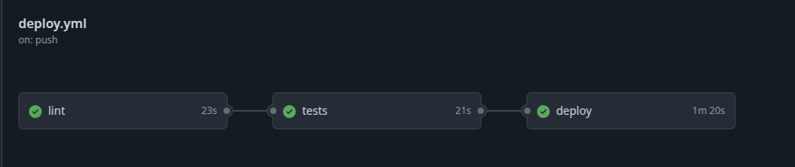
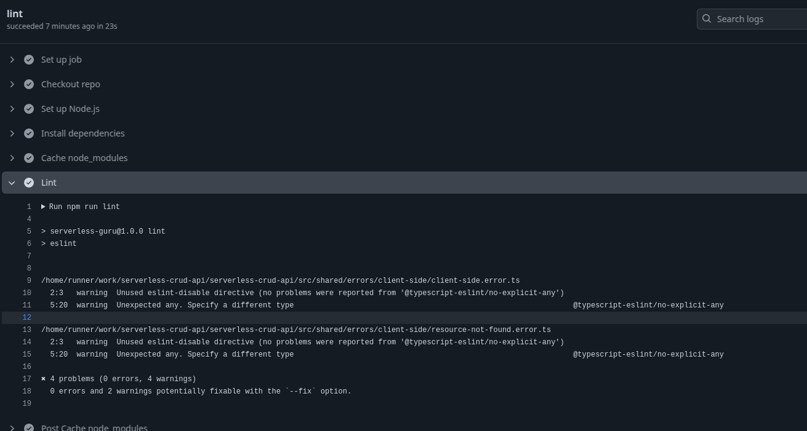
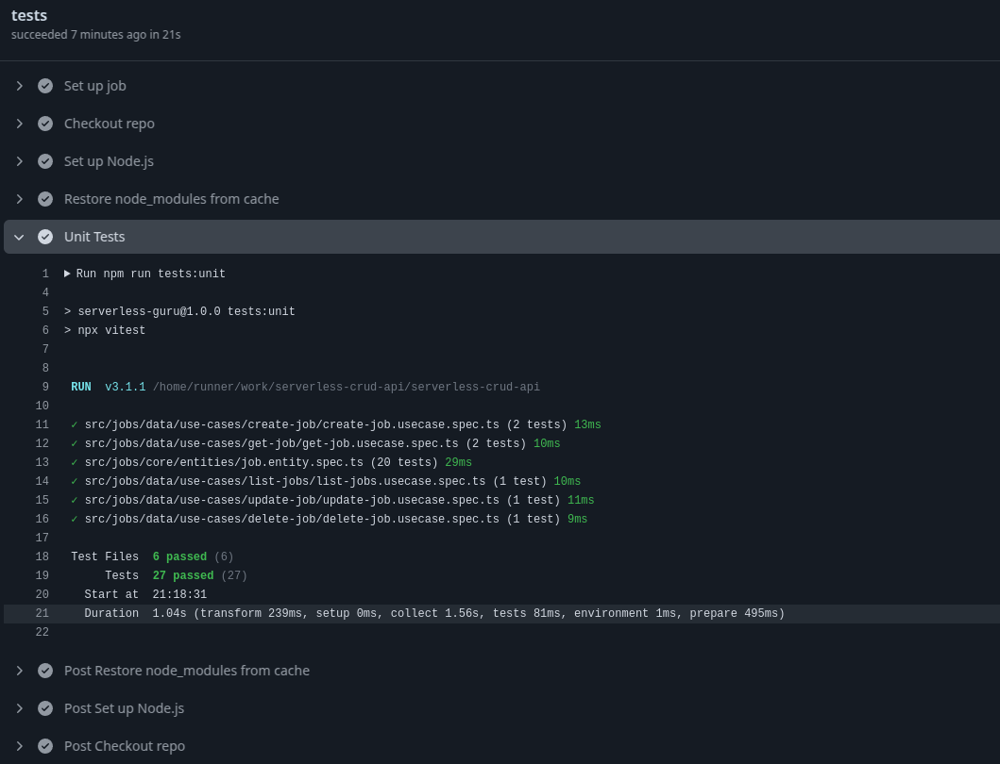
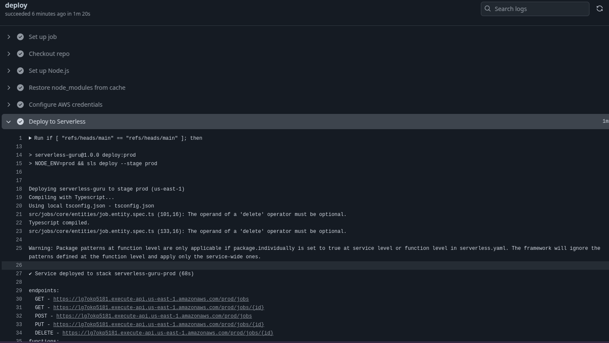
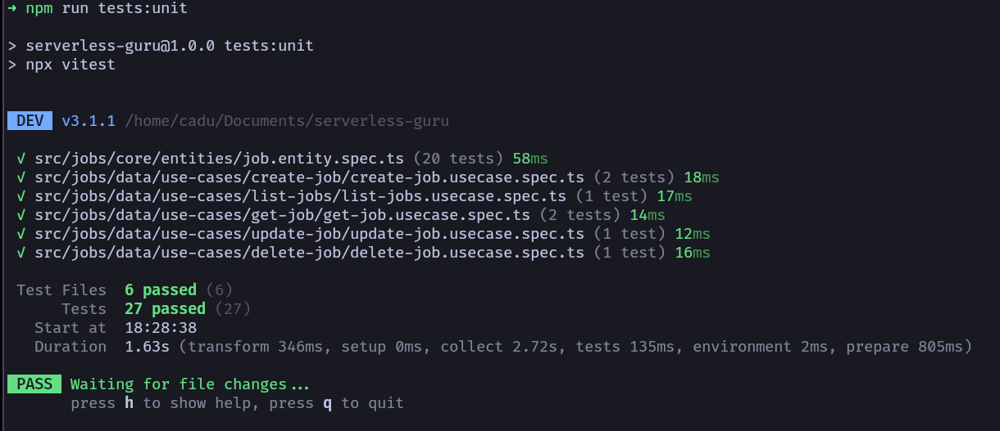

### About the project

This project is a Create, Read, Update, Delete (CRUD) of Jobs. The main idea here is to use serverless technologies and create all infraesctucture with IaC (Serverless framework). Also there is an CI/CD using github workflows that automatically deploys this code to AWS when code is pushed on master or dev branch.

### Main Technologies

- **Nodejs v20**: Runtime for running javascript code
- **Typescript 5**: Superset of javascript for types
- **AWS Lambda**: For deploying serverless functions
- **Dynamodb**: High scalable NoSQL database

### Libs

- **Serverless Framework**: For Infraestructure as code
- **Vitest**: For unit tests
- **Zod**: for schema validation
- **Eslint**: for lint and padronization
- **Prettier**: for code formating

## Code Design

The design of the code was made following Clean Architecture principles, such as:

- Inversion of Control: inner layers depends on abstractions like repositories;
- Inner layer doesn't know about outer layers;
- External implementations are provided by dependency injection, so it can be easily replaced if needed and makes testing easier.

### Project structure

**iac/** - Resources that will be created by serverless framework

**src/jobs/** - Module for Jobs

**src/jobs/application/** - AWS Lambda related code.

**src/job/core/** - All Entities and Value Objects of the system, and repository interface

**src/job/data/** - Repository implementation and Use cases

**src/job/infra/** - Controllers and factories to make all Dependency Injection

**test/** - Entity builder, repository mock implementation and utils

### CI/CD Configuration

CI/CD was configured using Github Workflows to deploy code into AWS.



- **Lint** - Runs eslint to detect inconsistent code style

  

- **Tests** - Runs all tests to ensure there is no regression

  

- **Deploy** - Deploy code to AWS

  

#### Multistages (Dev and Prod)

When code pushed into dev branch, will be created a dev version to API GTW, functions and DynamoDB table.

## How to run

Install dependencies

`npm i`

Run aws dynamo local

`docker run -p 8000:8000 amazon/dynamodb-local`

Run api with serverless framework

`npm run start:sls`

This will expose an api in **localhost:3004**

## API Endpoints

### Create a job

```
curl --location 'http://localhost:3004/local/jobs' \
--header 'Content-Type: application/json' \
--data '{
    "sallary": {
        "value": 8000,
        "currency": "USD"
    },
    "title": "Software Developer",
    "seniority": "SENIOR"
}'
```

### Update a job

```
curl --location --request PUT 'http://localhost:3004/local/jobs/:id' \
--header 'Content-Type: application/json' \
--data '{
    "title": "New Title"
}'

```

### Delete a job

```
curl --location --request DELETE 'http://localhost:3004/local/jobs/:id' \
--header 'Content-Type: application/json'
}'
```

### Get a job

```
curl --location 'http://localhost:3004/local/jobs/779545e0-efd8-46b4-adee-288c7514b6e3'
```

### List all jobs

```
curl --location 'http://localhost:3004/local/jobs'
```

### Running Tests

For suit tests just run:
`npm run tests:unit`


